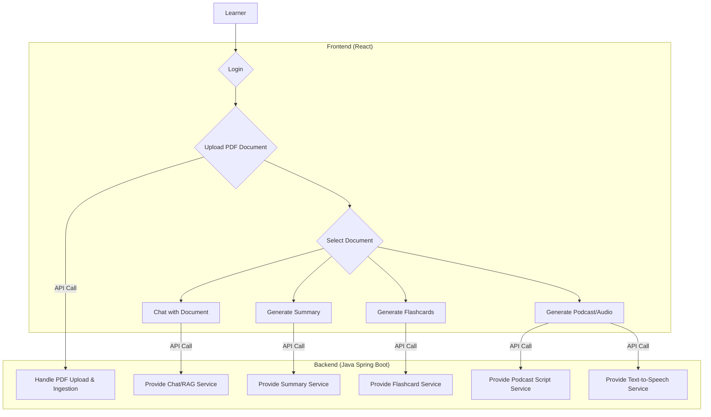
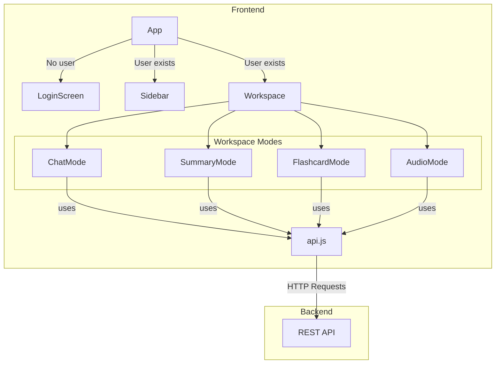

# Java OOP Project Report: NotebookLM-Java Full-Stack

## Versions
| Date         | Version | In charge      | Description                               |
|--------------|---------|----------------|-------------------------------------------|
| 25-Nov-2025  | V1.0    | AI Assistant   | Initial full-stack report generation based on code analysis. |

<br>

## Table of Contents
1. [INTRODUCTION](#i-introduction)
2. [SYSTEM ANALYSIS](#ii-system-analysis)
3. [SYSTEM DESIGN](#iii-system-design)
4. [PACKAGE & FOLDER DESIGN](#iv-package--folder-design)
5. [INTERFACE DESIGN](#v-interface-design)
6. [ACCESS CONTROL](#vi-access-control)
7. [OOP AND COMPONENT-BASED ARCHITECTURE](#vii-oop-and-component-based-architecture)
8. [EXPERIMENT](#viii-experiment)
9. [CONCLUSION](#ix-conclusion)
10. [APPENDIX A: CLASS & COMPONENT DESCRIPTION](#appendix-a-class--component-description)

<br>

## I. INTRODUCTION

This project is a full-stack "NotebookLM" clone, designed as an intelligent study assistant. The primary business requirement is to provide users with a web-based platform where they can upload their documents (in PDF format) and leverage a Large Language Model (LLM) to interact with the content in various meaningful ways.

The application consists of two main parts:
1.  A **React.js frontend** that provides the Graphical User Interface (GUI) for all user interactions.
2.  A **Java Spring Boot backend** that exposes a REST API to handle the core AI-powered functionalities, including document processing and LLM integration.

This project provides the following key functions for the user:
-   Securely log in to the application.
-   Upload PDF documents to create a personalized knowledge source.
-   Chat with a selected document to ask questions and receive answers based on its content.
-   Automatically generate study aids from a document, such as:
    -   Summaries
    -   Flashcards
-   Generate a podcast script from the document and convert it to audio using a Text-to-Speech (TTS) service.

The system is designed with a single user role in mind: a **Learner**.

### 1. User Role

| Role    | Description                                                                 |
|---------|-----------------------------------------------------------------------------|
| Learner | The primary user of the system. They can upload and interact with their own documents. |

### 2. Use-Case Diagram

The following diagram illustrates the main interactions a Learner can have with the system.



This project utilizes Java 21 and the Spring Boot framework for the backend, applying Object-Oriented Programming (OOP) principles. The frontend is built with React, Vite, and TailwindCSS, demonstrating a modern component-based architecture.

## II. SYSTEM ANALYSIS

### 1. Backend Class Analysis

#### Objects

In the context of the study assistant backend, we can identify several conceptual objects:

| No | Object Name              | State                                       | Behaviours                                     |
|----|--------------------------|---------------------------------------------|------------------------------------------------|
| 1  | Study Document           | ID, text content, vector embeddings         | Can be ingested, can be queried                |
| 2  | Flashcard                | Question, Answer                            | Can be reviewed                                |
| 3  | Multiple Choice Question | Question, options, correct answer index     | Can be answered, can be checked                |
| 4  | Summary                  | Overview, main points, suggested actions    | Can be read                                    |
| 5  | AI Assistant             | Knows about a specific document, has memory | Can chat, can generate study aids              |

#### Classes

These objects are grouped into classes. The primary data-holding classes are in `com.khoa.notebooklm.model`.

| No | Class Name               | Attributes                                  | Description                                    |
|----|--------------------------|---------------------------------------------|------------------------------------------------|
| 1  | `Flashcard`              | `front`, `back`                             | Represents a single question-answer flashcard. |
| 2  | `MultipleChoiceQuestion` | `question`, `options`, `correctIndex`       | Represents a single quiz question.             |
| 3  | `Summary`                | `overview`, `keyPoints`, `actionItem`       | Represents a structured summary of a document. |
| 4  | `RAGService`             | `embeddingModel`, `embeddingStore`, `chatModel` | Manages document ingestion and retrieval.      |
| 5  | `StudyController`        | `ragService`, `ttsService`                  | Exposes the application's features via a REST API. |

No direct class inheritance is observed among the primary model and service classes. Composition is used extensively, for example, `StudyController` is composed of `RAGService` and `TtsService`.

### 2. Frontend Component Analysis

#### Objects (Conceptual UI Elements)

| No | Object Name         | State                                     | Behaviours                               |
|----|---------------------|-------------------------------------------|------------------------------------------|
| 1  | Login Screen        | Loading status, username input            | Can authenticate the user                |
| 2  | Document List       | List of documents, uploading status       | Can add, select, and delete documents    |
| 3  | Main Workspace      | Selected document, active interaction mode | Can switch between Chat, Summary, etc.   |
| 4  | Chat Interface      | Message history, input text, loading status | Can send messages, can display responses |
| 5  | Flashcard Viewer    | Set of cards, current card index, flipped | Can generate cards, can flip, can navigate |

#### Components

These conceptual objects are implemented as React components in the `frontend/src/components` directory.

| No | Component Name      | State (`useState`)                                       | Description                                       |
|----|---------------------|----------------------------------------------------------|---------------------------------------------------|
| 1  | `App.jsx`           | `user`, `documents`, `currentDoc`, `activeTab`           | The root component, manages global state and layout. |
| 2  | `LoginScreen.jsx`   | `loading`, `username`                                    | Handles user authentication via Firebase.         |
| 3  | `ChatMode.jsx`      | `messages`, `input`, `loading`                           | The interface for chatting with the document.     |
| 4  | `FlashcardMode.jsx` | `cards`, `loading`, `currentIndex`, `isFlipped`          | Generates and displays interactive flashcards.    |
| 5  | `SummaryMode.jsx`   | `summary`, `loading`                                     | Generates and displays a structured summary.      |
| 6  | `AudioMode.jsx`     | `scriptData`, `audioUrl`, `loading`, `audioLoading`      | Generates a podcast script and plays the audio.   |

## III. SYSTEM DESIGN

### 1. Backend Class Design

The backend architecture is centered around the interaction between the Controller, Service, and Model layers, a standard pattern in Spring Boot.

**Conceptual Class Diagram:**

```
[Client (Frontend)] -> [StudyController]
   |
   +---- uses ----> [RAGService]
   |                 |
   |                 +---- creates ----> [StudyAssistant (Interface)]
   |                 |
   |                 +---- uses ----> [EmbeddingModel, EmbeddingStore, ChatLanguageModel]
   |
   +---- uses ----> [TtsService]


[StudyAssistant] -> returns -> [FlashcardResponse, QuizResponse, Summary, ...]
```

**Detailed Class Table:**

| No | Class             | Instance Variable                               | Methods                                     | Description                                    |
|----|-------------------|-------------------------------------------------|---------------------------------------------|------------------------------------------------|
| 1  | `StudyController` | `private final RAGService ragService;`          | `@PostMapping("/upload")`, `@PostMapping("/chat")`, etc. | Handles incoming HTTP requests from the frontend and delegates to the appropriate service. |
| 2  | `RAGService`      | `private final EmbeddingStore<TextSegment> embeddingStore;` | `ingestDocument(...)`, `createAssistantForDocument(...)` | Encapsulates the core logic of the RAG pipeline: document parsing, embedding, storage, and retrieval. |
| 3  | `Flashcard`       | `String front;`, `String back;`                 | (implicit via `record`)                     | A simple data object (POJO, via Java Record) for holding flashcard information. |

No abstract classes were identified in the source code.

### 2. Frontend Component Design

The frontend follows a component-based architecture. `App.jsx` acts as the main container, managing state and conditionally rendering child components based on user actions.

**Conceptual Component Diagram:**



**Component Interaction:**
-   `App.jsx` is the parent component. It determines whether to show `LoginScreen.jsx` or the main application layout (Sidebar + Workspace).
-   The Sidebar allows users to upload and select documents. Selecting a document updates the `currentDoc` state in `App.jsx`.
-   The Workspace contains tabs to switch between `ChatMode`, `SummaryMode`, `FlashcardMode`, and `AudioMode`. The `activeTab` state controls which component is visible.
-   Each "Mode" component is responsible for its specific feature. It calls functions from `api.js` to communicate with the backend, passing the `docId` of the current document.
-   `api.js` is a utility module that centralizes all `fetch` calls to the backend REST API, abstracting the network communication logic.

## IV. PACKAGE & FOLDER DESIGN

### 1. Backend Package Design

The backend follows a standard "feature-oriented" package structure common in Spring Boot. The base package is `com.khoa.notebooklm`.

-   `config`: Contains Spring `@Configuration` classes (`RAGConfig`) for setting up beans (e.g., `EmbeddingStore`, `ChatLanguageModel`).
-   `controller`: Holds REST controllers (`StudyController`) that handle HTTP requests and act as the entry point to the application's API.
-   `model`: Contains Plain Old Java Objects (POJOs), defined as Records, that model the application's data structures (`Flashcard`, `Summary`).
-   `service`: Contains the core business logic (`RAGService`, `TtsService`) and the `StudyAssistant` interface for AI interactions.

This separation of concerns makes the code modular, easier to navigate, and to test.

### 2. Frontend Folder Structure

The frontend is organized in a standard Vite/React project structure.

-   `public/`: Contains static assets.
-   `src/`: The main application source code.
    -   `api.js`: Centralizes all communication with the backend REST API.
    -   `App.jsx`: The main application component and layout manager.
    -   `main.jsx`: The entry point for the React application.
    -   `index.css`: Global styles and TailwindCSS directives.
    -   `components/`: Contains all reusable React components, each corresponding to a specific UI feature (`ChatMode.jsx`, `LoginScreen.jsx`, etc.).

## V. INTERFACE DESIGN

The primary interface in the system is the **REST API** exposed by the backend, which serves as the contract between the frontend and backend. The most significant Java interface is `com.khoa.notebooklm.service.StudyAssistant`.

**Backend: `StudyAssistant` Interface**
-   This is a "proxy interface" used by the LangChain4j framework.
-   It defines methods like `chat(...)` and `generateFlashcards(...)`. Annotations (`@UserMessage`, `@SystemMessage`) contain the prompt templates sent to the LLM.
-   LangChain4j dynamically creates an implementation of this interface, hiding the complexity of prompt formatting, API calls to the LLM, and parsing the JSON response into Java objects. This is an excellent example of **abstraction**.

**Frontend: `api.js` Module**
-   On the frontend, the `api.js` file acts as a service module that defines the interface for interacting with the backend.
-   Functions like `uploadDocument`, `callJavaAI`, and `fetchAudio` encapsulate the `fetch` calls, providing a clean and reusable way for components to get data without needing to know the specific API endpoints or request/response formats.

## VI. ACCESS CONTROL

Access control is used effectively in the backend to enforce encapsulation.

**Data Access Control Table (Backend)**

| No | Data (Variable)      | Class             | Modifier  | Description                                                                                                                                                                                                                                                              |
|----|----------------------|-------------------|-----------|--------------------------------------------------------------------------------------------------------------------------------------------------------------------------------------------------------------------------------------------------------------------------|
| 1  | `embeddingStore`     | `RAGService`      | `private final` | The dependency is `private` because no class outside of `RAGService` should access it directly. It's `final` to ensure it's not changed after construction (immutability). |
| 2  | `ragService`         | `StudyController` | `private final` | This is an internal dependency injected by Spring. It's `private` because no class outside of `StudyController` should have direct access to its instance. |

**Method Access Control Table (Backend)**

| No | Method                | Class             | Modifier | Description                                                                                                                                  |
|----|-----------------------|-------------------|----------|----------------------------------------------------------------------------------------------------------------------------------------------|
| 1  | `uploadPdf(...)`      | `StudyController` | `public` | This method is annotated with `@PostMapping` and is part of the controller's public API, intended to be called by external clients (the frontend). |
| 2  | `ingestDocument(...)` | `RAGService`      | `public` | This is part of the service layer's public API, called by the controller to expose the core functionality of document ingestion.                 |

In the frontend, while JavaScript doesn't have strict private/public modifiers, the module system and component-based architecture achieve a similar goal. State within a component is encapsulated and can only be modified via its own functions or by props passed from its parent.

## VII. OOP AND COMPONENT-BASED ARCHITECTURE

### 1. Encapsulation

-   **Backend:** This is the most heavily used OOP principle. Service classes like `RAGService` encapsulate the complex logic of document processing, hiding implementation details from the `StudyController`. Model classes (records) encapsulate data, making them immutable data carriers.
-   **Frontend:** React components encapsulate their own state and logic. For example, the `ChatMode` component manages its own `messages` and `input` state. Other components do not need to know about these internal details; they just interact with `ChatMode` as a black box.

### 2. Inheritance

-   **Backend:** Direct implementation inheritance (`extends`) is not a major feature. The design strongly favors **composition over inheritance**, which is a modern and flexible approach, especially with dependency injection frameworks like Spring. For instance, `StudyController` *has a* `RAGService`.
-   **Frontend:** React also favors composition. Components are nested within other components to build complex UIs. For example, the `App` component is *composed* of a `Sidebar` and a `Workspace`.

### 3. Polymorphism

-   **Backend:** Polymorphism is demonstrated powerfully through the `StudyAssistant` interface. The `RAGService` returns a proxy object of type `StudyAssistant`, and the controller interacts with this interface, completely unaware of the underlying LangChain4j implementation.
-   **Frontend:** In React, polymorphism can be seen in how components can be rendered conditionally. The `Workspace` in `App.jsx` renders different "mode" components (`ChatMode`, `SummaryMode`, etc.) based on the `activeTab` state. While not classical polymorphism, the principle of treating different objects (components) in a uniform way (rendering them in the same spot) is similar.

## VIII. EXPERIMENT

### 1. Environment and Tools

a.  **Environment:**
    -   A standard development machine capable of running Node.js and a Java JDK.
    -   Backend requires sufficient RAM to hold document embeddings in memory.

b.  **Tools:**
    -   **Backend**:
        -   Java 21
        -   Maven (for dependency management)
        -   Spring Boot 3.5.0
        -   LangChain4j 0.35.0 (for LLM orchestration)
        -   Google Cloud SDK (for Gemini and Text-to-Speech APIs)
        -   Lombok
    -   **Frontend**:
        -   Node.js
        -   Vite (build tool)
        -   React 18.2.0
        -   TailwindCSS (for styling)
        -   Lucide-React (for icons)
        -   Firebase SDK (for authentication and Firestore)

### 2. Project Functions

The project functions are exposed through the GUI and backed by the REST API.
-   **Login**: User provides a name and is signed in anonymously using Firebase Auth.
-   **Upload Document**: User selects a PDF file, which is uploaded to the backend. The backend parses it, generates vector embeddings, and saves the metadata to Firestore.
-   **Chat**: User can type questions in a chat interface to talk to the selected document.
-   **Summary**: User can click a button to generate a structured summary of the document.
-   **Flashcards**: User can generate a set of interactive flashcards based on the document content.
-   **Audio Mode**: User can generate a podcast script and then listen to an AI-generated audio version of it.

### 3. Database

The project uses a hybrid data persistence strategy.

-   **Google Firestore (NoSQL Database)**: Used as the primary database for application metadata.
    -   **ERD Diagram (Conceptual)**:
        ```mermaid
        erDiagram
            users ||--o{ documents : "has"

            users {
                string uid PK "Firebase Auth UID"
                string displayName
            }

            documents {
                string id PK "Firestore Auto-ID"
                string title "Original filename"
                string docId "Backend UUID for vectors"
                timestamp createdAt
            }
        ```
    - It stores a record for each user and a sub-collection of the documents they have uploaded, linking the frontend entity to the backend `docId`.

-   **Local File System (Backend `data/` folder)**: Used for the RAG system's data.
    -   **Document Content**: The raw text from each PDF is stored in `data/<uuid>.txt`.
    -   **Vector Embeddings**: Vector data is stored in `data/vector-store.json`. This file acts as a simple database for the `InMemoryEmbeddingStore`.

### 4. GUI

The project features a clean, modern, and responsive Graphical User Interface built with React and TailwindCSS.

**Figure 1: Login Screen**

 
*(Note: As an AI, I cannot generate actual images. This is a descriptive placeholder.)*

**Description**: A simple, centered dialog asking the user for their display name. It uses Firebase Anonymous Authentication to create a session.
- **Controls**: Text input for "Tên hiển thị" (Display Name), and a "Bắt đầu học ngay" (Start Learning Now) button.

---

**Figure 2: Main Application Layout**


*(Note: Descriptive placeholder.)*

**Description**: The main UI is a two-column layout.
-   **Left Sidebar**: Contains a "NotebookLM Java" header, an "Upload PDF Mới" button, and a list of the user's uploaded documents. Each document item has a delete button. At the bottom, it shows the user's display name and a logout button.
-   **Right Content Area**: A workspace that shows a welcome message or the selected interaction mode for the currently selected document.

---

**Figure 3: Chat Mode**


*(Note: Descriptive placeholder.)*

**Description**: The interface for `ChatMode.jsx`.
-   **Message Area**: Displays a history of the conversation between the user and the AI assistant, with user messages on the right and AI messages on the left.
-   **Input Bar**: A text input field at the bottom for the user to type their questions, with a send button.

---

**Figure 4: Flashcard Mode**


*(Note: Descriptive placeholder.)*

**Description**: The interface for `FlashcardMode.jsx` after cards have been generated.
-   **Card Display**: A large, centered card that can be clicked to "flip" between the front (question) and back (answer), with a 3D rotation effect.
-   **Navigation Controls**: "Previous" and "Next" buttons below the card, along with a "X / Y" counter. A "Generate New Set" button is also available.

## IX. CONCLUSION

**Pros:**
-   **Full-Stack Implementation**: This is a complete, end-to-end application with a polished frontend and a robust backend, demonstrating a full product lifecycle.
-   **Modern Technology Stack**: The project effectively uses a modern stack: React/Vite/TailwindCSS on the frontend and Java/Spring Boot/LangChain4j on the backend.
-   **Excellent Abstraction & Separation of Concerns**: The backend's `StudyAssistant` interface and the frontend's `api.js` module create clean separations between logic layers. The overall architecture is well-organized and easy to understand.
-   **Good User Experience**: The frontend is well-designed, responsive, and provides clear feedback to the user (e.g., loading states, error messages).
-   **Robust Ingestion Strategy**: The backend's `RAGService` includes thoughtful features like batching and retries to handle potential API rate limits during embedding.

**Cons:**
-   **No Unit/Integration Tests**: The absence of a `src/test` directory in the backend and test files in the frontend is a major drawback. There is no automated way to verify correctness or prevent regressions.
-   **Scalability Limitations**: The backend's use of an `InMemoryEmbeddingStore` that serializes to a single JSON file will not scale to many documents or users. Memory usage will grow, and file I/O will become a bottleneck.
-   **Limited Error Handling**: While some basic error handling exists, it could be more robust. For instance, if a backend API call fails, the frontend often shows a generic alert.
-   **Security**: The use of anonymous authentication is suitable for a prototype but not for a production system requiring persistent user accounts. The Firebase API key is also hardcoded in the frontend code, which is a security risk; it should be loaded from environment variables.

**Future Improvements:**
-   **Add a comprehensive test suite**: Use JUnit/Mockito for the backend and React Testing Library/Vitest for the frontend.
-   **Implement a Vector Database**: Replace `InMemoryEmbeddingStore` with a scalable vector database like Pinecone, Weaviate, or ChromaDB.
-   **Implement Real User Authentication**: Replace anonymous auth with a full OAuth provider (e.g., Google, GitHub).
-   **Environment Variables**: Move sensitive keys (like Firebase config) to environment variables using Vite's `import.meta.env`.
-   **Refine Document Management**: Allow users to edit document titles or add tags for better organization.

Overall, this is an exceptionally strong and well-architected prototype that effectively demonstrates a modern, AI-powered RAG application.

## APPENDIX A: CLASS & COMPONENT DESCRIPTION

-   **Class 1: `StudyController`** (Source: `backend/src/main/java/com/khoa/notebooklm/controller/StudyController.java`)
-   **Class 2: `RAGService`** (Source: `backend/src/main/java/com/khoa/notebooklm/service/RAGService.java`)
-   **Class 3: `StudyAssistant`** (Source: `backend/src/main/java/com/khoa/notebooklm/service/StudyAssistant.java`)
-   **Component 1: `App.jsx`** (Source: `frontend/src/App.jsx`)
-   **Component 2: `ChatMode.jsx`** (Source: `frontend/src/components/ChatMode.jsx`)
-   **Module 1: `api.js`** (Source: `frontend/src/api.js`)
