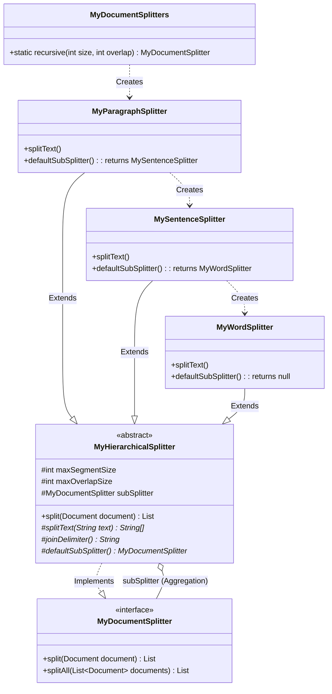

```mermaid
classDiagram
    %% --- 1. INTERFACE (Hợp đồng chung) ---
    class MyDocumentSplitter {
        <<interface>>
        +split(Document document) List<TextSegment>
        +splitAll(List~Document~ documents) List<TextSegment>
    }

    %% --- 2. ABSTRACT CLASS (Logic lõi) ---
    class MyHierarchicalSplitter {
        <<abstract>>
        #int maxSegmentSize
        #int maxOverlapSize
        #MyDocumentSplitter subSplitter
        
        +split(Document document) List<TextSegment>
        #splitText(String text)* String[]
        #joinDelimiter()* String
        #defaultSubSplitter()* MyDocumentSplitter
    }

    %% --- 3. CONCRETE CLASSES (Các cấp độ cắt) ---
    class MyParagraphSplitter {
        +splitText()
        +defaultSubSplitter() : returns MySentenceSplitter
    }

    class MySentenceSplitter {
        +splitText()
        +defaultSubSplitter() : returns MyWordSplitter
    }

    class MyWordSplitter {
        +splitText()
        +defaultSubSplitter() : returns null
    }

    %% --- 4. FACTORY (Nhà máy) ---
    class MyDocumentSplitters {
        +static recursive(int size, int overlap) MyDocumentSplitter
    }

    %% --- QUAN HỆ (RELATIONSHIPS) ---

    %% Inheritance (Kế thừa logic)
    MyHierarchicalSplitter ..|> MyDocumentSplitter : Implements
    MyParagraphSplitter --|> MyHierarchicalSplitter : Extends
    MySentenceSplitter --|> MyHierarchicalSplitter : Extends
    MyWordSplitter --|> MyHierarchicalSplitter : Extends

    %% Aggregation (Chứa đựng - Đệ quy)
    %% Class cha chứa một biến kiểu Interface -> Trỏ xuống cấp dưới
    MyHierarchicalSplitter o-- MyDocumentSplitter : subSplitter (Aggregation)

    %% Dependency (Phụ thuộc khởi tạo)
    MyDocumentSplitters ..> MyParagraphSplitter : Creates
    MyParagraphSplitter ..> MySentenceSplitter : Creates
    MySentenceSplitter ..> MyWordSplitter : Creates
```